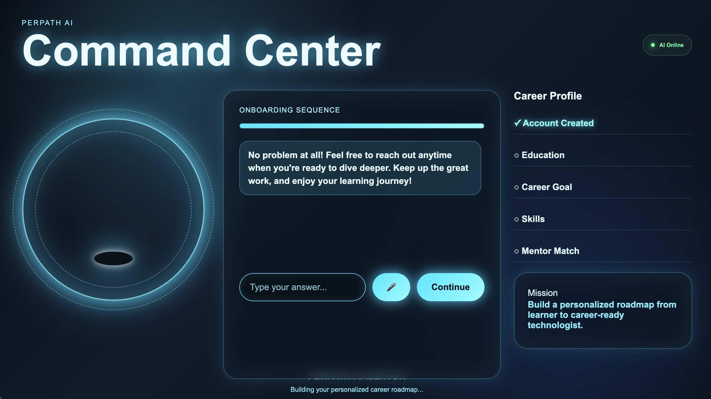
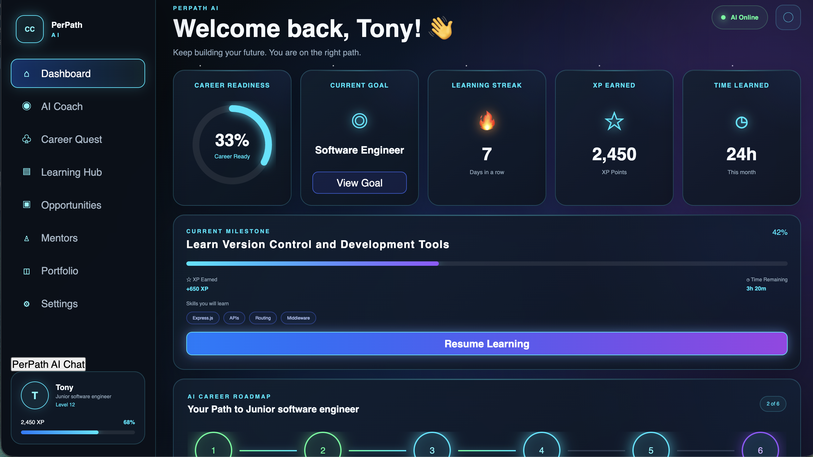
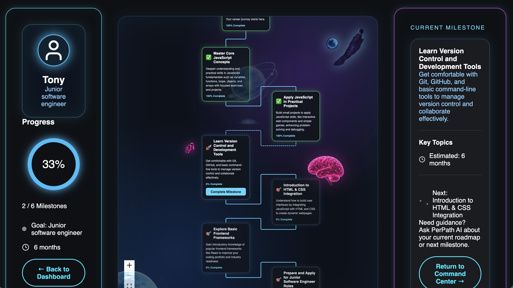

# 🚀 PerPath AI
### Illuminate Your Path

> **PerPath AI** is an AI-powered career navigation platform that helps Per Scholas learners, alumni, and aspiring technologists discover, visualize, and achieve their technology career goals through personalized roadmaps, conversational AI, and an immersive future visualization experience.

---

# 🌟 Overview

Breaking into technology can feel overwhelming. Many learners know **where they want to go**, but not **how to get there**.

PerPath AI transforms uncertainty into a personalized career journey. Through intelligent conversations, Retrieval-Augmented Generation (RAG), and interactive roadmap visualization, learners receive a customized path from their current skill level to their desired technology career.

Rather than providing generic career advice, PerPath AI understands each learner's background, goals, experience, and confidence to create a roadmap that evolves with them.

---

# 🎯 The Problem

Learners often struggle with:

- Knowing what to learn next
- Understanding how current skills translate into career opportunities
- Staying motivated throughout long learning journeys
- Finding relevant resources and guidance
- Visualizing long-term career growth

Without a personalized roadmap, career planning can become overwhelming and directionless.

---

# 💡 Our Solution

PerPath AI combines conversational AI, curriculum-aware roadmap generation, and interactive visualization into one platform.

The application:

- Conducts an AI-powered onboarding interview
- Builds a personalized learner profile
- Uses Retrieval-Augmented Generation (RAG) with the Per Scholas curriculum
- Generates an adaptive career roadmap
- Visualizes progress through an interactive career map
- Continues supporting learners through an AI Career Coach
- Tracks milestones, XP, streaks, and career readiness

---

# ✨ Features

## 🤖 AI Onboarding Experience

New users complete a conversational onboarding experience where the AI learns about:

- Education
- Training program
- Experience level
- Technical skills
- Confidence ratings
- Career goals
- Learning obstacles

The information is saved to build a personalized learner profile.

---

## 💬 AI Career Coach

The AI doesn't disappear after onboarding.

Learners have continuous access to the AI Career Coach to:

- Ask career questions
- Receive learning guidance
- Get roadmap clarification
- Stay motivated
- Navigate their next milestone
- Explore career opportunities

The AI grows alongside the learner throughout their journey.

---

## 🧠 Retrieval-Augmented Generation (RAG)

Instead of generating generic career advice, PerPath AI grounds its responses using the Per Scholas curriculum.

Our RAG pipeline:

1. Uploads the curriculum rubric (PDF)
2. Parses the document
3. Splits the content into searchable chunks
4. Retrieves the most relevant curriculum sections
5. Sends those sections to OpenAI as context
6. Generates a personalized roadmap aligned with both learner goals and curriculum expectations

This produces more accurate, relevant, and personalized career guidance.

---

## 🗺 AI Career Roadmap

Every learner receives a personalized roadmap containing:

- Career milestones
- Weekly goals
- Learning resources
- Estimated completion timeline
- Progress tracking
- Personalized recommendations

---

## 🚀 Future Visualization Engine

Built using **React Flow**, learners can explore an interactive roadmap that visually represents their career journey.

The visualization displays:

- Completed milestones
- Current milestone
- Future learning objectives
- Career progression
- Interactive navigation

---

## 📊 Learner Dashboard

The dashboard gives learners a real-time view of their progress.

Features include:

- Career Readiness Score
- Current Goal
- Learning Streak
- XP System
- Learning Time
- Current Milestone
- Progress Tracking
- Resource Recommendations

---

## 💼 Opportunities Portal

Learners can explore curated technology companies and future employment opportunities aligned with their career goals.

---

## 🔒 Authentication

Secure authentication includes:

- User Registration
- Login
- JWT Authentication
- Protected Routes
- Persistent Sessions

---

# 🧠 AI Architecture

```text
Learner Registration
        │
        ▼
AI Onboarding Conversation
        │
        ▼
Learner Profile Created
        │
        ▼
Upload Curriculum Rubric (PDF)
        │
        ▼
Parse & Chunk Document
        │
        ▼
Retrieve Relevant Curriculum Sections (RAG)
        │
        ▼
OpenAI GPT-4.1-mini
        │
        ▼
Personalized Career Roadmap
        │
        ▼
MongoDB Storage
        │
        ▼
Dashboard + React Flow Visualization
        │
        ▼
Continuous AI Career Coach
```

---

# 🛠 Tech Stack

## Frontend

- React
- TypeScript
- Vite
- React Router
- Axios
- React Flow
- CSS

## Backend

- Node.js
- Express.js
- MongoDB
- Mongoose
- JWT Authentication
- bcrypt
- Multer

## Artificial Intelligence

- OpenAI API (GPT-4.1-mini)
- Retrieval-Augmented Generation (RAG)
- Prompt Engineering
- PDF Context Retrieval

---

# 📚 Libraries & Resources

### Libraries

- React Flow
- Axios
- Mongoose
- JWT
- bcrypt
- Multer
- pdf-parse

### APIs

- OpenAI API

### Assets

- React Icons
- Google Fonts (if applicable)

---

# 📸 Application Preview

## AI Command Center



---

## Learner Dashboard



---

## Interactive Career Roadmap



---

# ⚙️ Installation

Clone the repository

```bash
git clone https://github.com/Kriviears/Hackjam-2026-team-04.git
```

Install dependencies

```bash
cd client
npm install

cd ../server
npm install
```

Create a `.env` file

```env
OPENAI_API_KEY=your_key
JWT_SECRET=your_secret
MONGODB_URI=your_connection_string
```

Run the application

```bash
npm run dev
```

---

# 📂 Project Structure

```text
client/
│── components/
│── pages/
│── services/
│── assets/

server/
│── controllers/
│── middleware/
│── models/
│── routes/
│── services/
│── uploads/
```

---

# 🚀 Future Enhancements

- Resume analysis with AI feedback
- AI mock interviews
- Employer matching
- Mentor recommendations
- Skill-gap analysis
- Achievement badges
- Real-time labor market insights
- Calendar integration
- Internship recommendations
- Adaptive roadmap updates based on learner progress

---

# 👥 Team

**Team 04**

Developed for the **CGI × Per Scholas HackJam 2026 – Tech Futures: Illuminate Your Path**

---

# 🙏 Acknowledgements

Special thanks to:

- Per Scholas
- CGI
- OpenAI
- React Flow
- The HackJam mentors and organizers